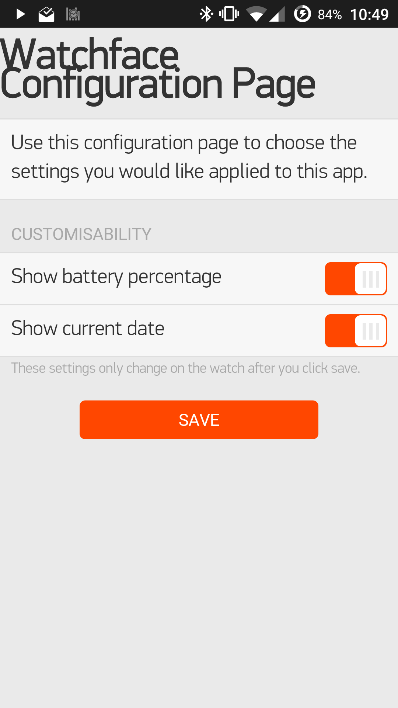

# pebble-config
Pebble config page with query string option loading

Handles the following options:

- batteryPercentage
- showDate
- showWeather
- hourlyVibrate
- bluetoothVibrate

Options can be selectively loaded using the `?options=` query parameter. Omit to display all options. E.g:

`http://pebble.geraintwhite.co.uk/?options=batteryPercentage+showDate` displays:

